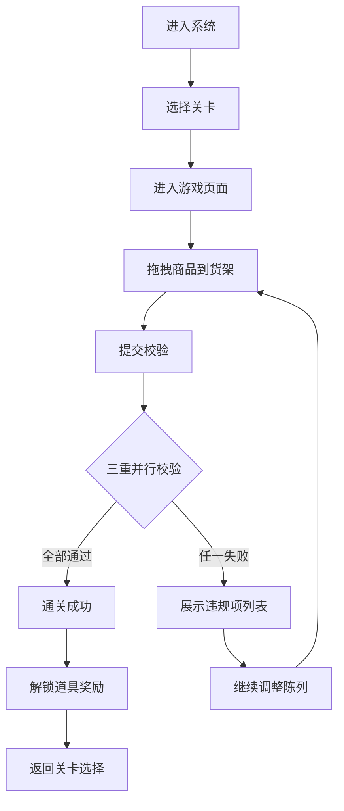

## 1. 产品概述

货架陈列实训系统是一款面向零售行业从业者的培训工具，通过拖拽式交互模拟真实货架陈列场景，训练从业者掌握商品陈列规范。系统采用三重并行校验机制（承重限制、位置规则、库存上限），确保玩家全面掌握陈列要点。

- 目标用户：零售从业者、陈列培训学员
- 核心价值：通过游戏化方式快速掌握商品陈列规则，提升陈列技能
- 市场定位：实训教育类工具型应用

## 2. 核心功能

### 2.1 用户角色

| 角色 | 注册方式 | 核心权限 |
|------|----------|----------|
| 学员用户 | 直接使用 | 闯关学习、使用道具、查看成绩 |

### 2.2 功能模块

1. **实训画布**：商品素材区、货架陈列区、拖拽交互操作
2. **校验系统**：承重限制校验、位置规则校验、库存数量校验
3. **关卡系统**：多关卡递进、难度递增、通关解锁
4. **道具系统**：稀缺陈列道具、使用次数限制、关卡解锁获取

### 2.3 页面详情

| 页面名称 | 模块名称 | 功能描述 |
|---------|----------|----------|
| 主页面 | 关卡选择区 | 展示所有关卡、锁定/解锁状态、当前进度 |
| 主页面 | 道具背包 | 展示已获得道具、剩余使用次数 |
| 游戏页面 | 素材拖拽区 | 展示可拖拽商品素材、商品属性信息 |
| 游戏页面 | 货架陈列区 | 多层货架展示、商品放置位置、实时反馈 |
| 游戏页面 | 校验结果面板 | 违规项分条列出、通过/失败状态 |
| 游戏页面 | 操作栏 | 提交校验、重置、返回关卡选择 |

## 3. 核心流程

用户进入系统后选择关卡，进入游戏页面后从素材区拖拽商品到货架上进行陈列。完成陈列后点击提交校验，系统同步校验三项规则（承重/位置/数量），全部通过则通关并解锁道具，失败则展示所有违规项。

## 4. 用户界面设计

### 4.1 设计风格

- **主色调**：温暖的橙色系（#FF6B35）搭配深棕色（#2D1810），营造超市/便利店的温馨氛围
- **辅助色**：绿色（#10B981）表示成功、红色（#EF4444）表示失败、金色（#F59E0B）表示道具
- **按钮风格**：圆润立体按钮，带有悬浮动效和按压反馈
- **字体**：标题使用粗体无衬线字体，正文使用清晰易读的常规字体
- **布局风格**：卡片式布局、阴影层次分明、木纹质感货架
- **图标风格**：扁平化卡通风格图标，与商品主题契合

### 4.2 页面设计概述

| 页面名称 | 模块名称 | UI 元素 |
|---------|----------|---------|
| 主页面 | 关卡选择区 | 卡片式关卡展示、进度条、锁定图标、星星评分 |
| 主页面 | 道具背包 | 道具卡片、数量徽章、金色渐变边框 |
| 游戏页面 | 素材拖拽区 | 商品卡片网格、商品名称、重量/属性标签、拖拽效果 |
| 游戏页面 | 货架陈列区 | 多层木质货架、放置槽位、商品悬浮预览、实时高亮 |
| 游戏页面 | 校验结果面板 | 左侧失败项列表（红色叉号）、右侧通过项列表（绿色勾号） |
| 游戏页面 | 操作栏 | 主按钮（提交校验）、次按钮（重置/返回） |

### 4.3 响应式设计

采用桌面端优先设计，针对实训场景优化大屏体验，同时适配平板设备。拖拽交互优先支持鼠标操作，同时提供触屏兼容。

### 4.4 动效与交互

- 商品拖拽时有缩放和阴影跟随效果
- 放置到货架时有吸附动画
- 校验结果有渐进式展示动画
- 通关时有庆祝粒子动效
- 悬停时有轻微上浮效果
