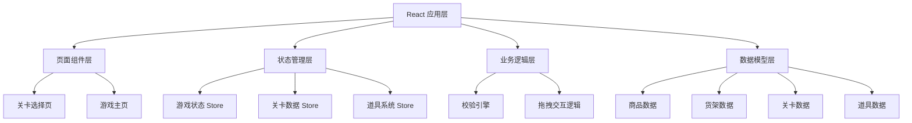
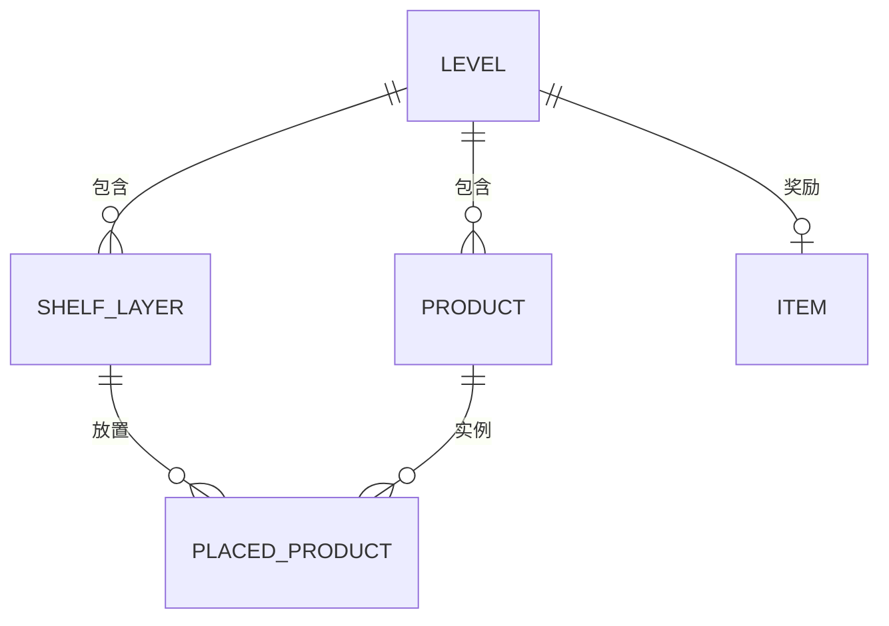

## 1. 架构设计

本项目为纯前端单页应用，采用 React + Vite + TailwindCSS 技术栈，状态管理使用 Zustand。所有数据使用 Mock 数据，无需后端服务。



## 2. 技术描述

- **前端框架**：React@18 + TypeScript
- **构建工具**：Vite@5
- **样式方案**：TailwindCSS@3
- **状态管理**：Zustand
- **路由管理**：React Router DOM@6
- **图标库**：Lucide React
- **拖拽方案**：HTML5 原生拖拽 API + 自定义拖拽逻辑

## 3. 目录结构

```
src/
├── components/          # 可复用组件
│   ├── ProductCard.tsx  # 商品卡片组件
│   ├── Shelf.tsx        # 货架组件
│   ├── ShelfLayer.tsx   # 货架层组件
│   ├── LevelCard.tsx    # 关卡卡片组件
│   ├── ItemCard.tsx     # 道具卡片组件
│   └── ValidationPanel.tsx # 校验结果面板
├── pages/               # 页面组件
│   ├── Home.tsx         # 首页（关卡选择）
│   └── Game.tsx         # 游戏页面
├── store/               # 状态管理
│   ├── useGameStore.ts  # 游戏状态
│   ├── useLevelStore.ts # 关卡数据
│   └── useItemStore.ts  # 道具系统
├── data/                # Mock 数据
│   ├── products.ts      # 商品数据
│   ├── levels.ts        # 关卡数据
│   └── items.ts         # 道具数据
├── types/               # 类型定义
│   └── index.ts         # 所有类型定义
├── utils/               # 工具函数
│   └── validator.ts     # 校验引擎
├── App.tsx              # 应用入口
├── main.tsx             # 渲染入口
└── index.css            # 全局样式
```

## 4. 路由定义

| 路由 | 页面 | 说明 |
|------|------|------|
| / | 首页 | 关卡选择、道具背包展示 |
| /game/:levelId | 游戏页 | 拖拽陈列、校验、结果展示 |

## 5. 数据模型

### 5.1 核心实体关系



### 5.2 数据类型定义

```typescript
// 商品类型
interface Product {
  id: string;
  name: string;
  emoji: string;
  weight: number;      // 重量（用于承重校验
  isHot: boolean;      // 是否热销（用于位置校验
  category: string;    // 分类（用于分区校验
  maxStock: number;    // 单类最大库存数量
}

// 货架层
interface ShelfLayer {
  id: string;
  level: number;       // 层级 (0=底层, 1=中层, 2=上层)
  name: string;
  maxWeight: number;   // 最大承重
  maxSlots: number;    // 最大槽位数
  isVisual: boolean;   // 是否视觉位
}

// 已放置商品
interface PlacedProduct {
  productId: string;
  shelfLayerId: string;
  position: number;    // 槽位位置
}

// 关卡
interface Level {
  id: string;
  name: string;
  description: string;
  difficulty: number;
  unlocked: boolean;
  completed: boolean;
  products: Product[];
  shelfLayers: ShelfLayer[];
  rewardItemId?: string;
  rules: {
    weightCheck: boolean;
    positionCheck: boolean;
    stockCheck: boolean;
  };
}

// 道具
interface Item {
  id: string;
  name: string;
  description: string;
  emoji: string;
  effect: string;
  remaining: number;
}

// 校验结果
interface ValidationResult {
  passed: boolean;
  violations: ValidationViolation[];
}

interface ValidationViolation {
  type: 'weight' | 'position' | 'stock';
  message: string;
  details?: string;
}
```

### 5.3 校验引擎逻辑

校验引擎接收当前货架布局，并行执行三项检查：

1. **承重校验**：遍历每一层货架，计算该层所有商品总重量，与该层最大承重比较
2. **位置校验**：检查热销商品是否都在中层视觉位，重物商品是否在底层
3. **库存校验**：统计每类商品在所有层的总数量，与该商品最大库存比较

三项检查同时执行，结果汇总后统一返回。
